<h1 align="center">MERN Movies Recommender 🎬</h1>

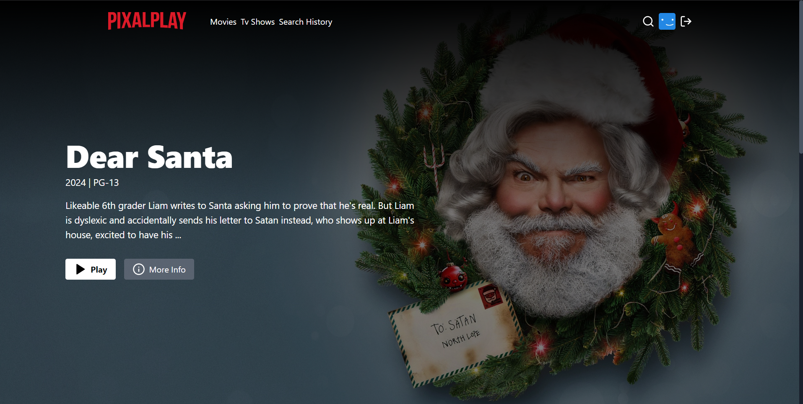
<p align="center">
<h2>Overview</h2>

- ⚛️ Tech Stack: React.js, Node.js, Express.js, MongoDB, Tailwind
- 🔐 Authentication with JWT
- 📱 Responsive UI
- 🎬 Fetch Movies and Tv Show
- 🔎 Search for Actors and Movies
- 🎥 Watch Trailers
- 🔥 Fetch Search History
- 🐱‍👤 Get Similar Movies/Tv Shows
- 💙 Awesome Landing Page
- 🌐 Deployment
- 🚀 And Many More Cool Features
</p>

### Setup .env file

```bash
PORT=5000
MONGO_URI=your_mongo_uri
NODE_ENV=development
JWT_SECRET=your_jwt_secre
TMDB_API_KEY=your_tmdb_api_key
```

### Run this app locally

```shell
npm run build
```

### Start the app

```shell
npm run dev
```

## Images

### Home


### Movies
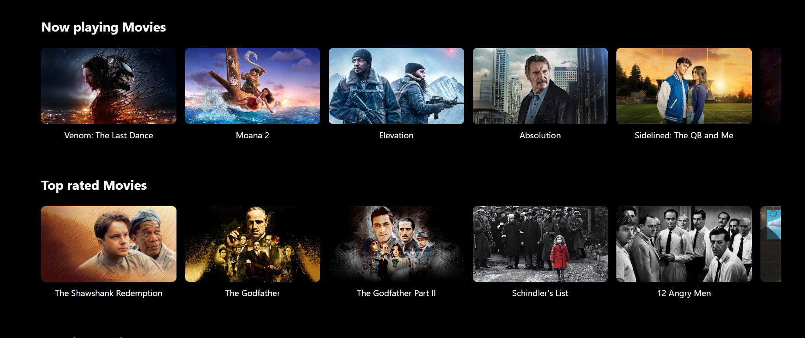
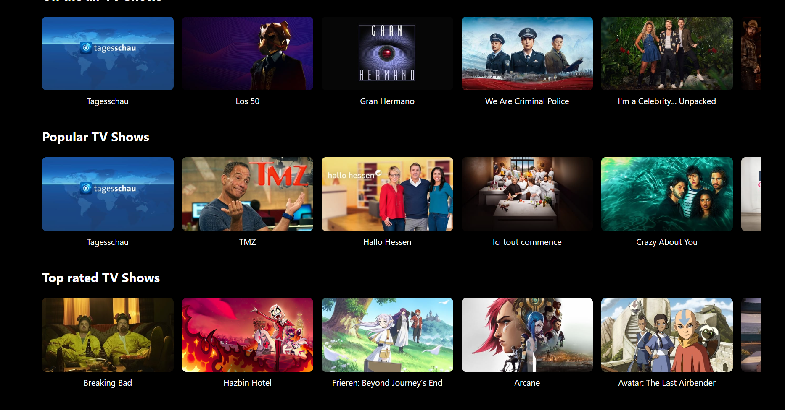

### Movie Profile
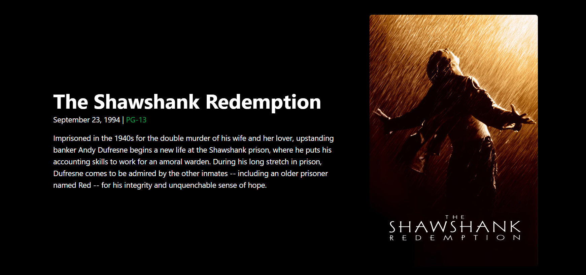
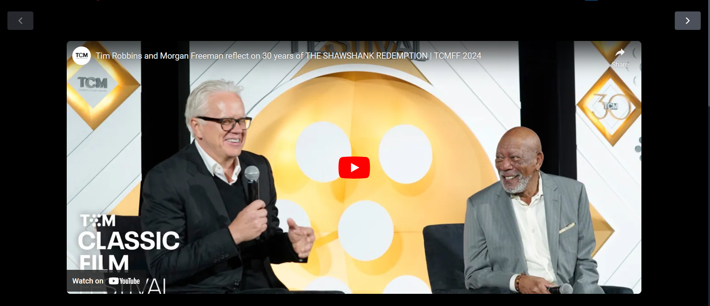
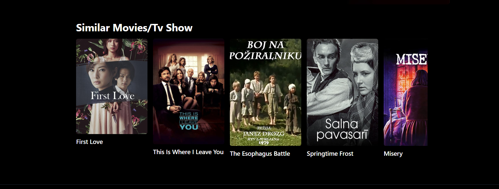

### Search
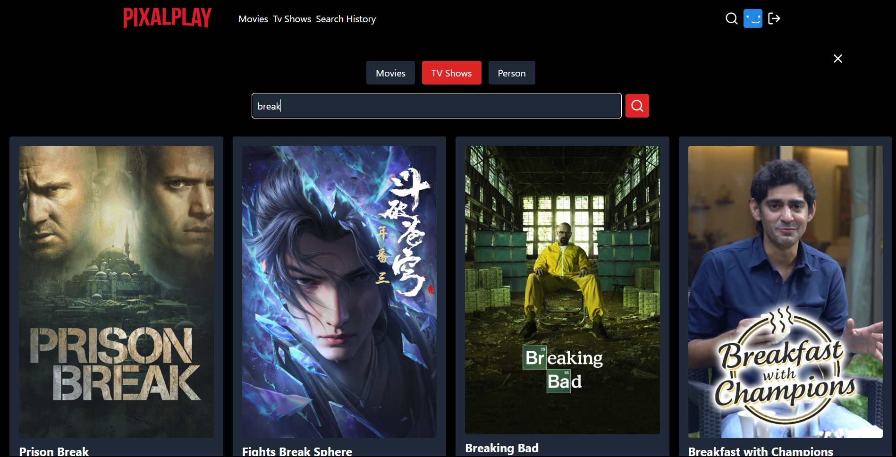
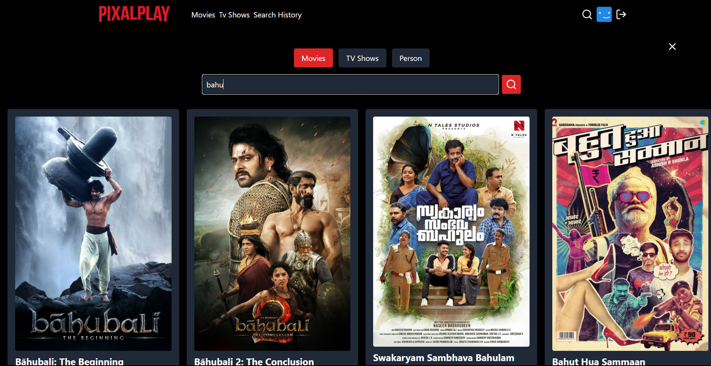

### History
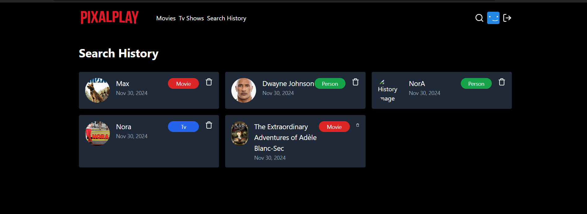

### Login
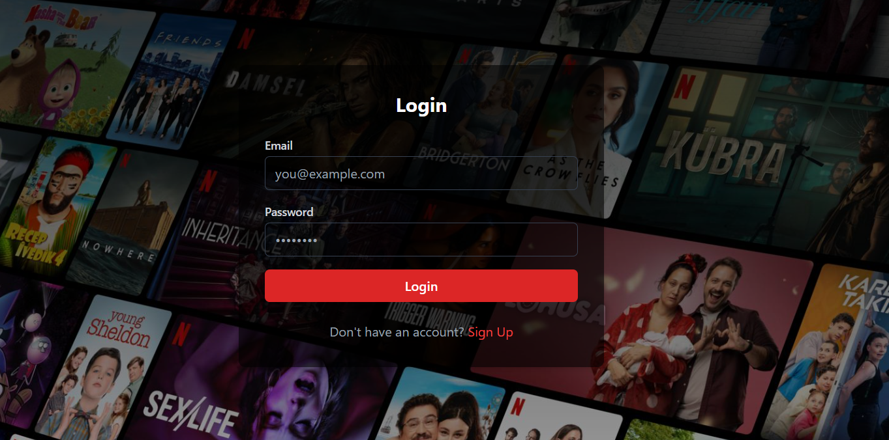

### Sign Up
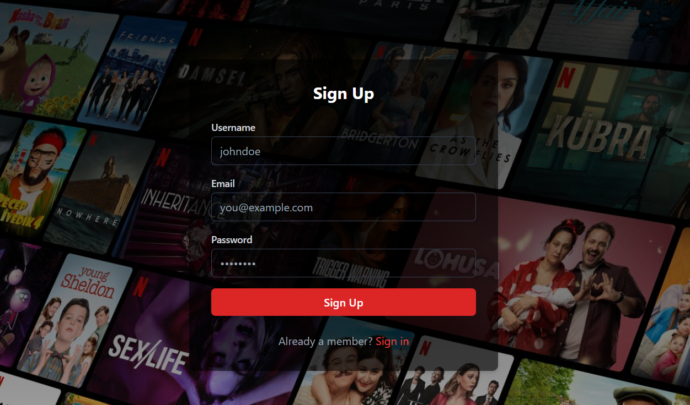